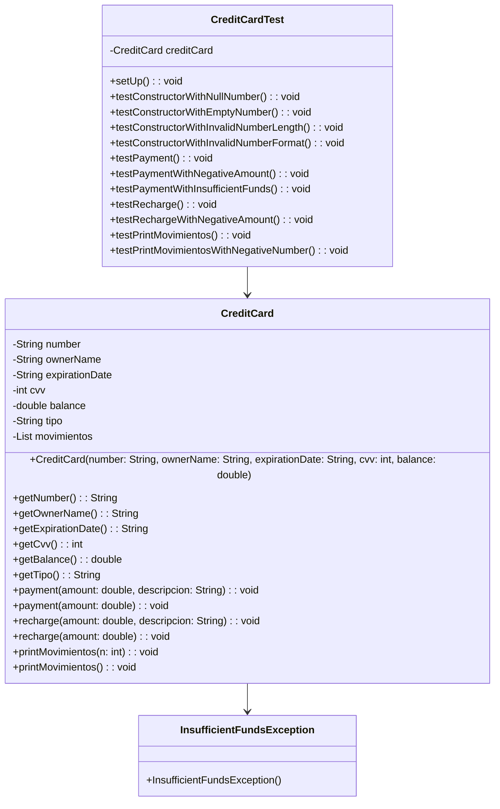

# Ejercicio utilizando jUnit: CreditCard
Este ejercicio consiste en utilizar el framework jUnit para diseñar y codificar una suite de pruebas unitarias para la clase CreditCard, que simula la interfaz y el comportamiento de una tarjeta de crédito.

## Diagrama UML
El diagrama UML para la clase CreditCard se muestra a continuación:

